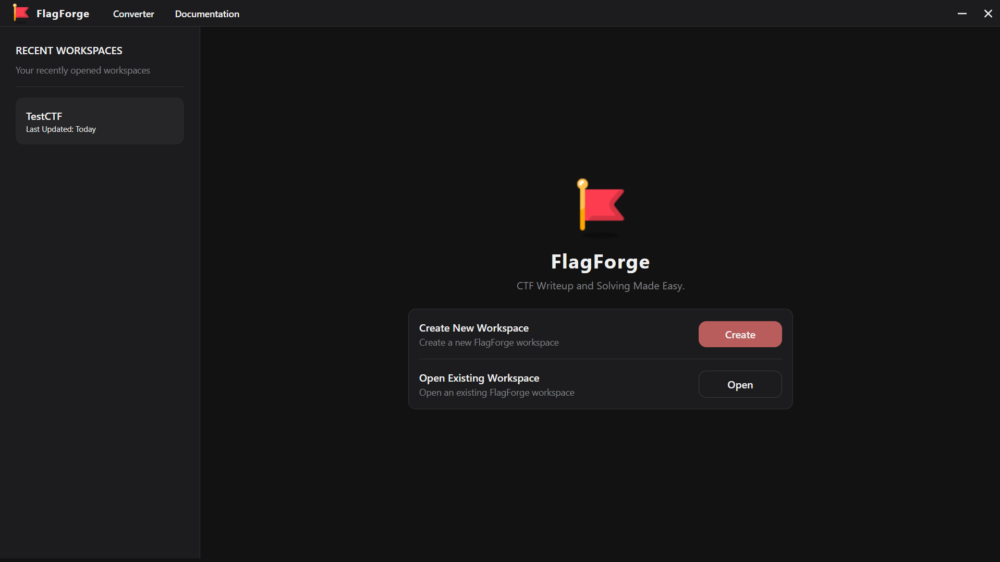

# The FlagForge Launcher
---

---

The FlagForge Launcher is the first step in the FlagForge workflow. It shows a list of really important things:

* The left sidebar shows the list of recently opened workspaces. On clicking one of the few recently opened workspaces, the workspace will be opened in the main area.
* The main area shows options to either create a new workspace: giving a name and a location for it; or to open an existing workspace: by selecting a `workspace.json` file

---

Proceeding with any of the options, the workspace will be opened in the main area.

Want to know what a workspace is? Check out the **Workspace** page for more information.

Happy hacking!
