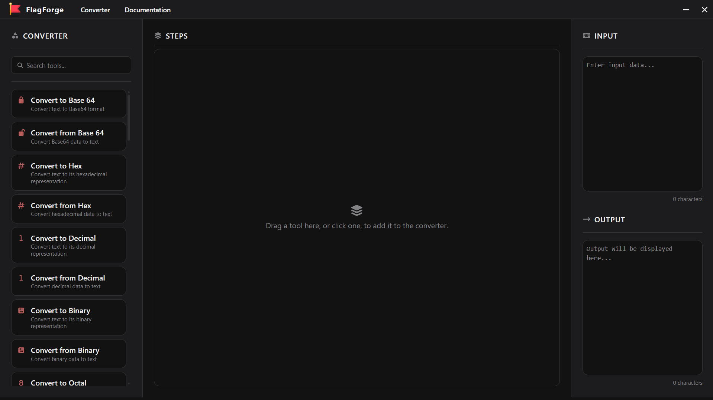
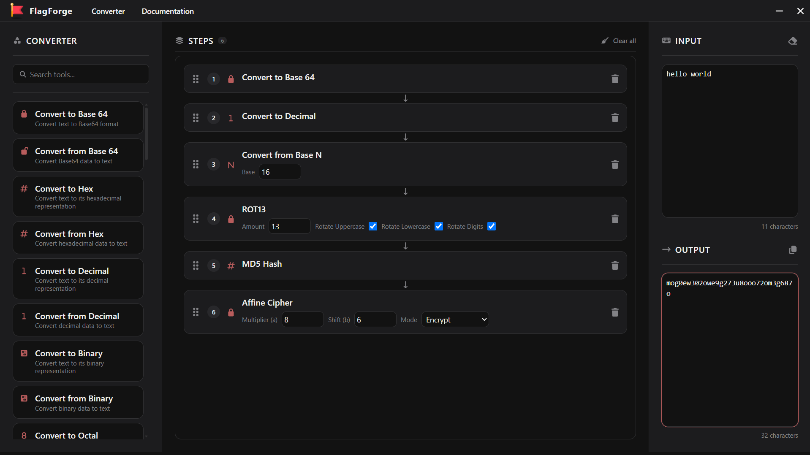

# Converter Tools in FlagForge
---

FlagForge includes a collection of converter tools that allow you to transform and decode data in various formats. These tools are inspired by CyberChef and provide a user-friendly interface for performing common CTF operations.

---

## How to Access?
The converter tools can be accessed from the ribbon at the top of the application. Click on the "Converter" tab to open the converter tools section.

---

## The Converter Window

On the left sidebar, you will find a list of available converter tools categorized into different sections such as **Data Conversion**, **Cryptography**, **Hashing**, and many more. Each section contains a variety of tools that can be used to perform specific operations on the input data.

Clicking or Dragging a tool from the left sidebar will add it to the main area, where you can configure its settings and apply it to the input data.

The main area is where you see all the tools that you have added and their respective configurations. You can add multiple tools to the main area and chain them together to perform complex transformations on the input data. You can also rearrange the order of the tools by dragging them up or down in the main area.

The right sidebar is where you can input the data that you want to transform or decode. You can either type the data directly into the input field or paste it from an external source. The output of the transformation will be displayed in the output field below the input field.

There are buttons in order to quickly clear the input as well as the steps in the main area. This is useful when you want to start fresh with a new input or a new set of transformations.

The output is shows immediately as you type or paste the input data. This allows you to see the results of your transformations in real-time, making it easier to experiment with different tools and configurations.

---

## Available Converter Tools
The converter tools are organized into different categories, each containing a variety of tools for specific operations.

1. **Data Conversion:** Tools for converting data between different formats:
    * To/From Base64
    * To/From Hexadecimal
    * To/From Binary
    * To/From Decimal
    * To/From Octal
    * To/From Base N (2-36)
    * Encode/Decode URLs
    * To/From Base32
    * To/From Base45
    * and many more...

2. **Cryptography:** Tools for encrypting and decrypting data using various algorithms:
    * Encrypt/Decrypt AES (Advanced Encryption Standard)
    * Encrypt/Decrypt DES (Data Encryption Standard)
    * Encrypt/Decrypt Triple DES
    * Encrypt/Decrypt Blowfish
    * Encrypt/Decrypt RC4
    * ROT13 and ROT47 Ciphers
    * XOR Cipher
    * Vigenère Cipher
    * Atbash Cipher
    * Affine Cipher
    * A1Z26 Cipher
    * and many more...

3. **Hashing:** Tools for generating cryptographic hashes of data:
    * MD5
    * SHA-1
    * SHA-2
    * Bcrypt
    * RIPEMD160
    * and many more...

---

There are infinite possibilities with the converter tools in FlagForge. You can chain multiple tools together to create complex transformations and decodings, making it a powerful utility for CTF challenges and data analysis.

These can be accessed anywhere in the application, making it easy to perform quick transformations without leaving your workflow.

All the complex tools are discussed in detail with the working and examples in the **Tools** section of the documentation.

Happy hacking!
